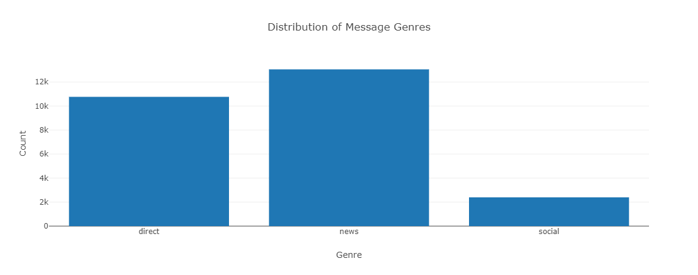
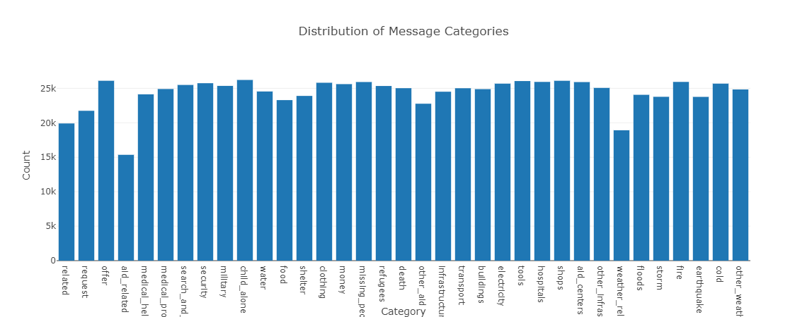

# Disaster Response Pipeline
##### Ahmad faqihi, 27, jan, 2022
### Abstract
We used a data set that contained genuine messages sent during disasters for this project. We built a machine learning pipeline to classify these occurrences so you may send messages to the right disaster relief organization. This project includes a web interface that allows a first responder to enter a new message and receive classification results in a variety of categories. The data will be visualized on the web app as well.

### Files
 ##### 1. process_data.py
 
 Witch Is an ETL pipeline that ensure to complete the following tasks:-
 - Loads messages and categories datasets
 - Merges messages and categories datasets into one dataset
 - Cleans the data
 - saves the data in a SQLite database.

 ##### 2. train_classifier.py 
Machine learning pipeline that ensure to complete following tasks:-
 - Loads data from the SQLite database
 - Split the dataset into two dataset one for training and the other for testing
 - Creates a pipeline for text processing and machine learning.
 - Trains the model from the trining dataset
 - Test the model with the testing dataset
 - Saves the model in a pickle file

##### 3. run .py
 
 Witch Is crate a web app that have access to the database and it have two visualizations Distribution of Message Genres and Distribution of Message Categories.
 
  
  

### Instructions:
1. Run the following commands in the project's root directory to set up your database and model.

    - To run ETL pipeline that cleans data and stores in database
        `python data/process_data.py data/disaster_messages.csv data/disaster_categories.csv data/DisasterResponse.db`
    - To run ML pipeline that trains classifier and saves
        `python models/train_classifier.py data/DisasterResponse.db models/classifier.pkl`

2. Run the following command in the app's directory to run your web app.
    `python run.py`

3. Go to http://0.0.0.0:3001/
